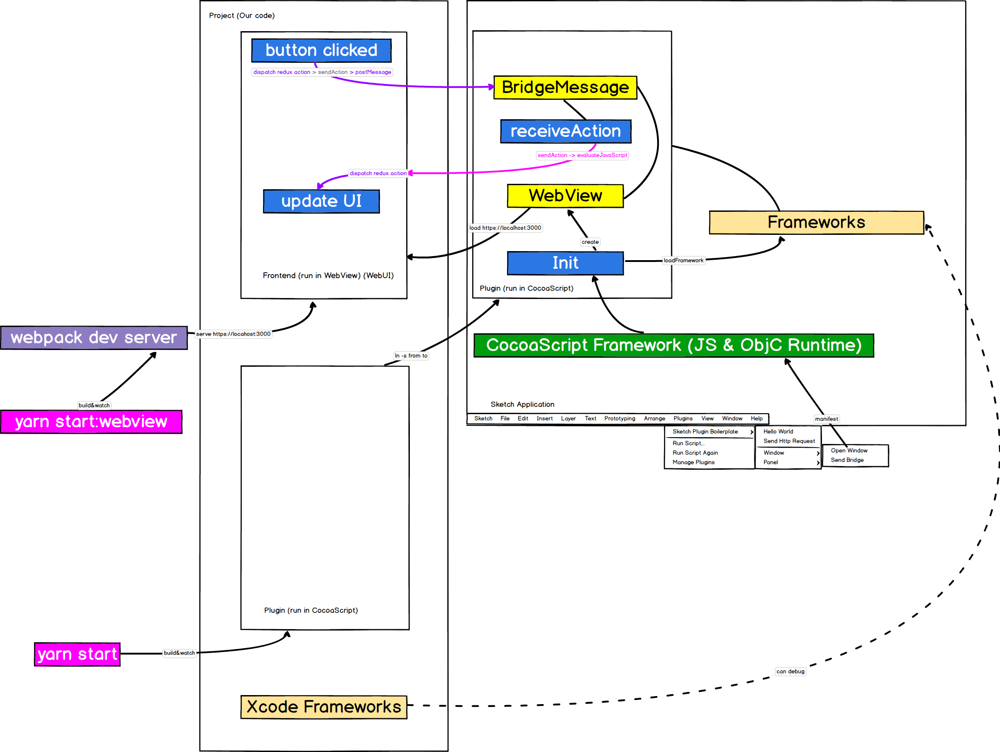

# Communication and Architecture

## Notices
#### Webpack dev server

* When developing the frontend code, we use webpack dev server to serve https://localhost:3000.

  This way, we make our frontend developing the same as web developing experience. (js scss live-reload, safari web inspector debugging)
  
  Notice, it needs https protocol to load in Sketch webview. 
  The easiest way to solve this, is to manually trust the webpack dev server default localhost certificate in **Keychain Access** Application on your Mac.
  
* When deploy the plugin, from `yarn bundle`, we load the build file.

#### Framework
I use Xcode and CocoaPods to create framework, which is loaded by CocoaScript.

Why I need to build framework, because:

1. CocoaScript can't identify `dispatch_async`, so multi thread programs should be written in ObjC and called by js.
   Be careful, the js code should be in the `block` of `dispatch_async(dispatch_get_main_queue(), block)` cause it should be run on the main thread.
   
2. Because there is already been a lot of third party ObjC frameworks, we can develop some code based on them. 
   Coding objective C on Xcode is a good selection while hand writing javascript is not. 
   Because no type information, no IDE, and translation between the two languages is disturbing.

You need to notarize all your frameworks.

You can debug your framework code by set **Edit Scheme/Run/Debug & Ask on Launch**, then select **Sketch**.

I manually copy the released frameworks build by Xcode into the `./src/frameworks` folder, 
then call `loadFramework` to load them. I think this is not so elegant, [todo].